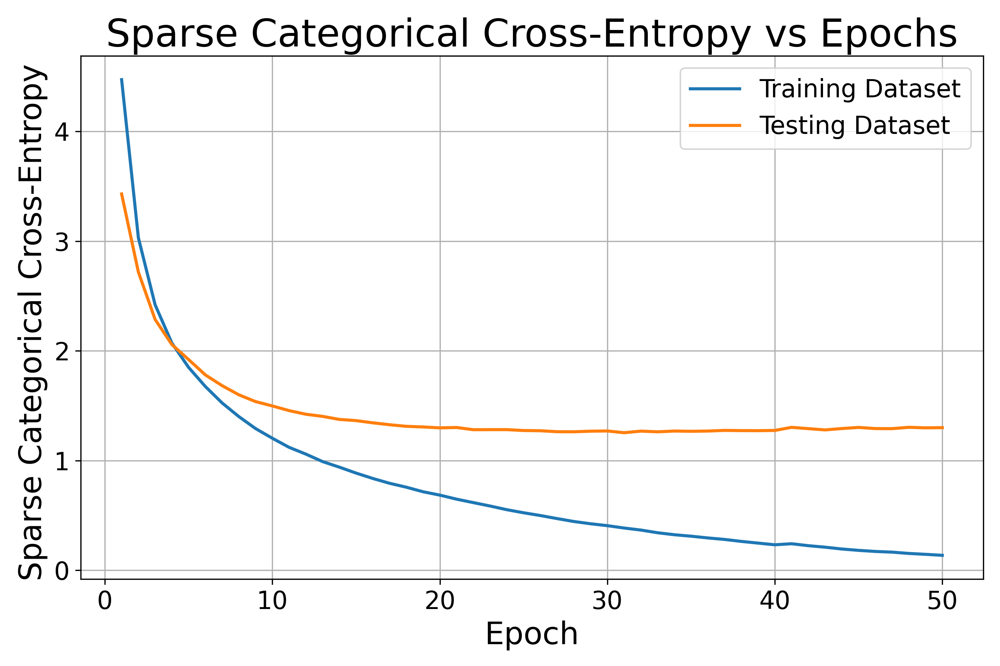
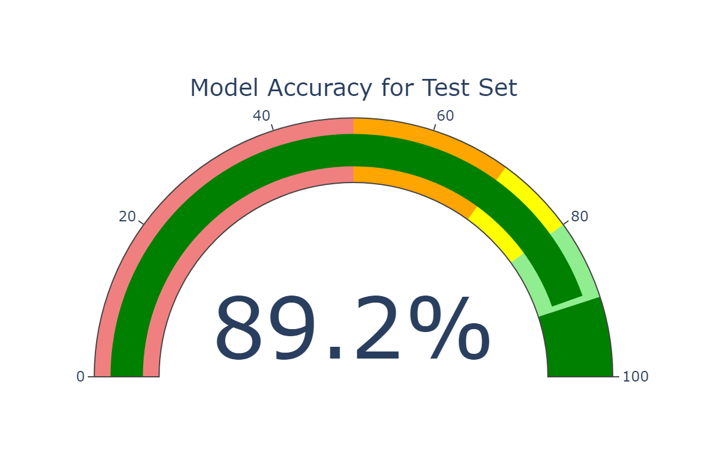
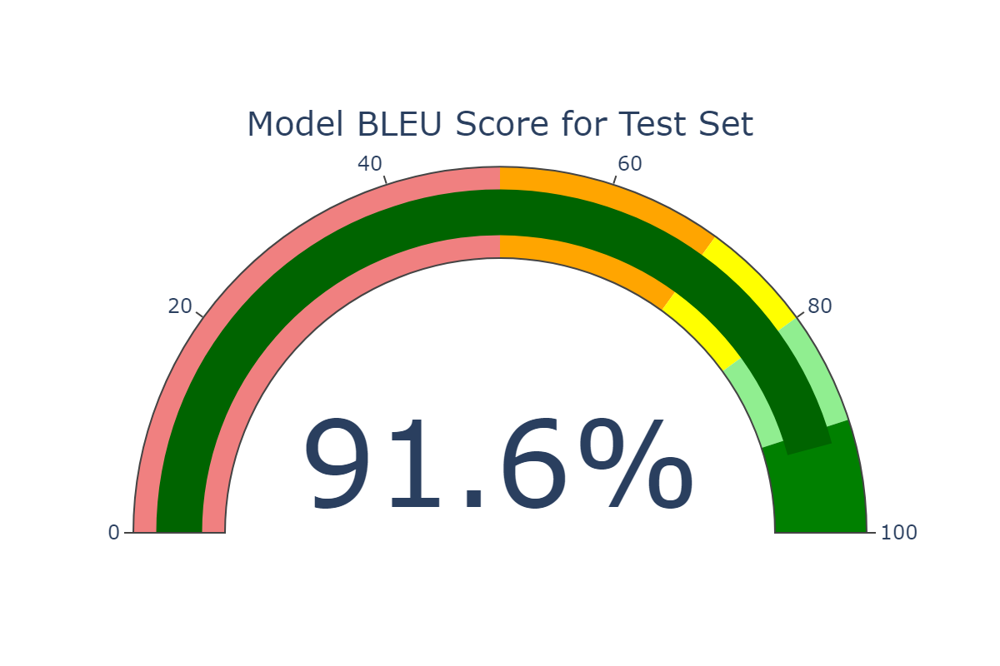

# English to Urdu Machine Translation Using Seq2Seq Model

This project implements an English to Urdu machine translation model using a sequence-to-sequence (Seq2Seq) architecture with LSTM. The model is trained on a dataset of 1,213 English-Urdu sentence pairs. The system leverages pre-trained word embeddings and uses an encoder-decoder architecture with LSTM units to perform translation tasks.

## Specifications

- **Dataset Size**: 1,213 sentence pairs
- **Maximum Input Sequence Length (English)**: 10 tokens
- **Maximum Target Sequence Length (Urdu)**: 15 tokens
- **Dataset Input Vocabulary Size (English)**: 589 unique words
- **Dataset Target Vocabulary Size (Urdu)**: 665 unique words
- **Training Dataset Size**: 970 sentence pairs (80% of the data)
- **Testing Dataset Size**: 243 sentence pairs (20% of the data)

## Embeddings

- **Input Embedding**: GoogleNews-vectors-negative300-SLIM.bin (Pre-trained word vectors)
  - **Input Embedding Size**: 300 dimensions
- **Target Embedding**: urduvec_140M_100K_300d.bin (Pre-trained Urdu word vectors)
  - **Target Embedding Size**: 300 dimensions

## Model Architecture

The model follows an **encoder-decoder** architecture with **LSTM** layers:

- **Encoder**: Encodes the input English sentence into a context vector.
- **Decoder**: Generates the output Urdu sentence from the context vector, using the encoded states from the encoder.

## Model Configuration

- **Latent Dimensionality**: 64
- **Loss Function**: Sparse categorical cross-entropy (SCCE)
- **Optimizer**: Adam optimizer with a learning rate of 0.01
- **Batch Size**: 64
- **Epochs**: 50

## Training Performance

- **Training Set Accuracy**: 98.93%
- **Training Set Loss (SCCE)**: 0.1212

## Testing Performance

- **Testing Dataset Accuracy**: 89.16%
- **Testing Dataset Loss (SCCE)**: 1.2997
- **Testing Dataset BLEU Score**: 91.6024 (measured using `sacrebleu`)

## Results

## Sample Translations

### Correct Translations:
- **English**: I like black coffee  
  **Urdu**: مجھے سیاہ کافی پسند ہے

- **English**: I'm tired  
  **Urdu**: میں تھکا ہوا ہوں

### Incorrect Translations:
- **English**: I’m so happy for you  
  **Urdu**: مجھے لئے بہت خوشی ہو رہی ہے

- **English**: I like eating strawberries  
  **Urdu**: مجھے آڑو کھانا پسند ہے

### Required Libraries:

- **numpy**: For numerical computations and data handling.
- **tensorflow**: For building and training the Seq2Seq model.
- **pandas**: For handling data preprocessing.
- **gensim**: For loading pre-trained word embeddings.
- **scikit-learn**: For data splitting.
- **sacrebleu**: For calculating BLEU score for model evaluation.
- **matplotlib**: For plotting visualizations.
- **contractions**: For expanding contractions in text.